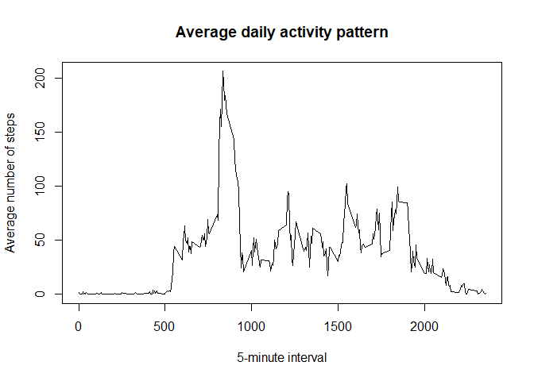

## Loading and preprocessing the data

**Data is loaded and date is formatted in data format.**

```r
data <- read.csv("activity.csv")
data$date <- as.Date(data$date, format = "%Y-%m-%d")
```


## What is mean total number of steps taken per day?

**Histogram of the total number of steps taken each day:**


```r
steps_by_day <- aggregate(steps ~ date, data, sum)
hist(steps_by_day$steps, breaks = 30, main = "Total steps taken per day", xlab = "Total steps per day", ylab = "Number of days")
```

<!-- -->

**Mean and Median total number of steps taken per day are calculated:*


```r
meansteps <-  mean(steps_by_day$steps)
medisteps <-  median(steps_by_day$steps)
meansteps <- format(meansteps, scientific = FALSE, big.mark = ",")
medisteps <- format(medisteps, scientific = FALSE, big.mark = ",")
```

Mean number of steps per day: 10,766.19  
Median number of steps per day: 10,765

## What is the average daily activity pattern?

**Time series plot of the average number of steps taken across all days displayed in 5-minute intervals** 


```r
steps_by_interval <- aggregate(steps ~ interval, data, mean)
plot(steps_by_interval$interval, steps_by_interval$steps, type="l", main = "Average daily activity pattern", xlab="5-minute interval", ylab="Average number of steps")
```

<!-- -->


**5-minute interval with maximum number of steps on average across all the days.**


```r
max_interval <- steps_by_interval[which.max(steps_by_interval$steps),1]
max_interval <- format(max_interval, scientific = FALSE, big.mark=",")
```

Time interval with maximum number of steps: 835.

## Imputing missing values

**Total number of missing values in the dataset, i.e. the total number of rows with NAs**


```r
incomplete_data <- sum(!complete.cases(data))
```

Number of rows with NAs: 2304


**Strategy for filling in all of the missing values in the dataset:** 
mean for the 5-minute interval

**Create new dataset based on origianl dataset with missing data filled in.**


```r
imputed_data <- transform(data, steps = ifelse(is.na(data$steps), steps_by_interval$steps[match(data$interval, steps_by_interval$interval)], data$steps))
```

**Histogram of the total number of steps taken each day, report mean and median total number of steps taken per day**


```r
imputed_steps_by_day <- aggregate(steps ~ date, imputed_data, sum)
hist(imputed_steps_by_day$steps, breaks= 30, main = "Total number of steps taken each day", xlab = "Total steps per day", ylab = "Number of days")
```

<!-- -->

```r
meanst <- mean(imputed_steps_by_day$steps)
medianst <- median(imputed_steps_by_day$steps)
meanst <- format(meanst, scientific=FALSE, big.mark=",")
medianst <- format(medianst, scientific=FALSE, big.mark=",")
```

The average number of steps in the imputed dataset: 10,766.19  
The median number of steps in the imputed dataset: 10,766.19

**Impact of imputing missing data on the estimates of the the total daily number of steps.**


```r
corr_mean <- mean(steps_by_day$steps)
imputed_mean <- mean(imputed_steps_by_day$steps)
diff <- imputed_mean - corr_mean
corr_mean <- format(corr_mean, scientific=FALSE, big.mark=",")
imputed_mean <- format(imputed_mean, scientific=FALSE, big.mark=",")
diff <- format(diff, scientific=FALSE, big.mark=",")
```

Average number of steps in **original** dataset: 10,766.19

Average number of steps in **imputed** dataset: 10,766.19

The difference between original and imputed data for the average number of steps is: 0

## Are there differences in activity patterns between weekdays and weekends?

**New factor variable indicating weekday and weekend**


```r
imputed_data$weekday <- weekdays(imputed_data$date)
imputed_data$weekend <- (ifelse(imputed_data$weekday == "Samstag" | imputed_data$weekday == "Sonntag", "Weekend", "Weekday"))
```

**Panel plot containing time series plot of the 5-minute interval and the average number of steps taken**


```r
imputed_steps_by_interval <- aggregate(steps ~ interval + weekend, imputed_data, mean)

library(lattice)

xyplot(imputed_steps_by_interval$steps ~ imputed_steps_by_interval$interval|imputed_steps_by_interval$weekend, main="Average Steps on weekdays vs. weekends by Interval",xlab="5-minute interval", ylab="Average number of steps",layout=c(1,2), type="l")
```

<!-- -->
